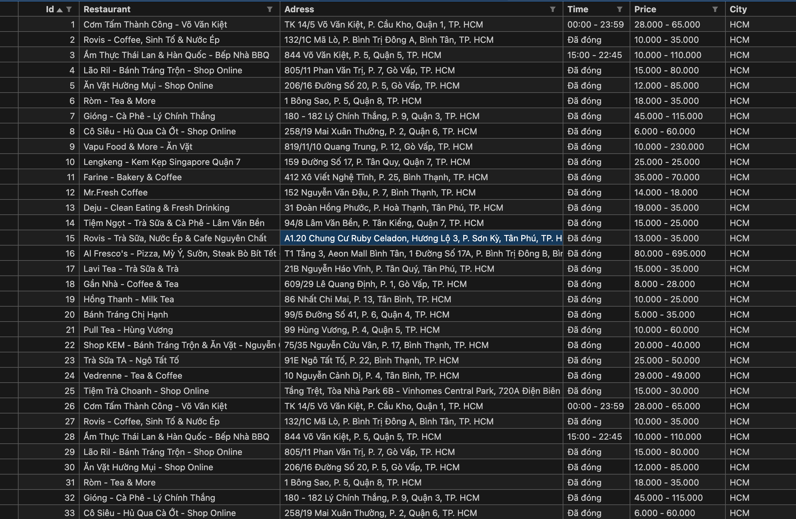

# 🍜 ShopeeFood Web Scraping

**ShopeeFood_Web_Scraping** is a Python project designed to scrape restaurant and food-related information from [ShopeeFood Vietnam](https://shopeefood.vn/). The goal is to automate data collection for purposes such as food trend analysis, pricing research, and restaurant performance tracking.


## 🎯 Project Objectives

This project focuses on collecting and organizing data from ShopeeFood with the following key outputs:

- **Restaurant Metadata**
    - Name, address, categories, coordinates, and delivery info
- **Menu Information**
    - Dishes, prices, descriptions, availability
- **Ratings and Reviews**
    - Average rating, number of reviewers, tags (e.g., "tasty", "fast delivery")


## 🛠️ Technologies Used

- **Python 3.x** – core programming language
- **Requests** – for sending HTTP requests
- **Selenium**
- **Pandas** – for processing and exporting structured data
- **JSON / CSV** – for storing results
- **Time / Random** – for delay logic to avoid getting blocked


## 📦 Project Structure

```
SHOPEEFOOD_WEB_SCRAPING/  
├── .gitattributes  
├── links_shopee.txt  
├── README.md  
├── restaurant_shopefood.csv  
└── shopeefood_webscraping.ipynb  
```


## Output Data

**Format**: CSV

**Example CSV Output**:



## 🔍 How the Code Works

### Step 1: Get Restaurant Links

- The `get_links.py` script sends requests to category/location-based ShopeeFood URLs.
- Parses pagination pages to gather all restaurant page URLs.

### Step 2: Extract Restaurant Details

- The `get_restaurant_info.py` script loops through restaurant URLs.
- Extracts key fields like name, location, menu, prices, ratings, etc.
- Cleans and structures the data for export.

### Step 3: Save Data

- Data is stored in both `.json` (raw) and `.csv` (tabular) formats.
- Files are saved into the `/output` directory for later use or analysis.


## 📊 Potential Applications

- Market research on food delivery platforms
- Menu and pricing trend analysis
- Clustering restaurants by cuisine, rating, or delivery zones
- Building dashboards for F&B performance by city or district
